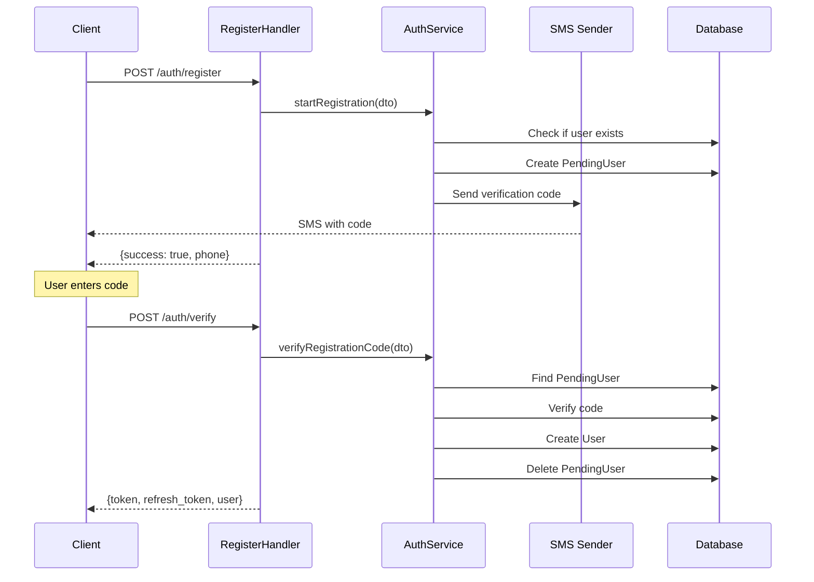
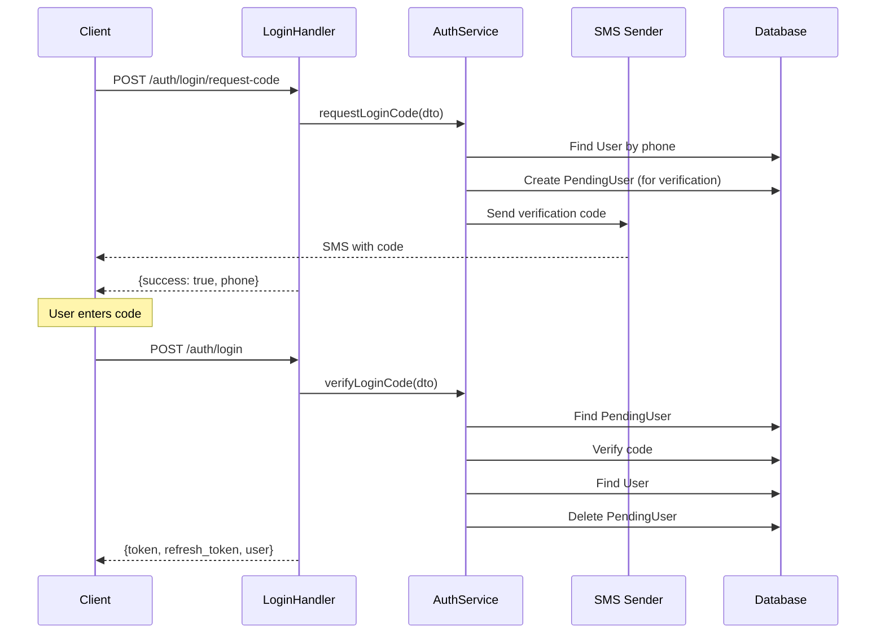
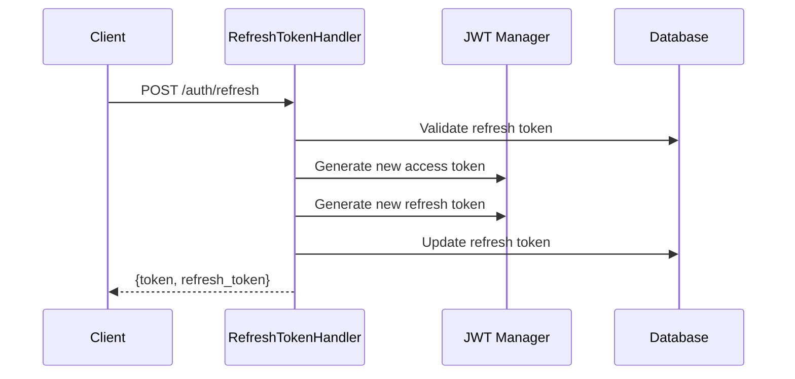

# Auth Module

**Authentication and Authorization Module**

## Overview

The Auth module is responsible for user authentication, registration, and authorization using JWT tokens with refresh token support. It implements SMS-based verification for both registration and login.

## Responsibility

- User registration with SMS verification
- User authentication (login) with SMS codes
- JWT access token generation and management
- Refresh token generation and management
- Token validation and refresh
- User session management
- Automatic cleanup of expired tokens and pending registrations

## Architecture

### Clean Architecture Layers

```
┌─────────────────────────────────────────┐
│         Presentation Layer              │
│  (Handlers - HTTP Controllers)          │
│  - RegisterHandler                      │
│  - VerifyCodeHandler                    │
│  - LoginHandler                         │
│  - RefreshTokenHandler                  │
│  - CurrentUserHandler                   │
│  - LogoutHandler                        │
└─────────────────────────────────────────┘
              ↓
┌─────────────────────────────────────────┐
│         Application Layer                │
│  (Services - Business Logic)            │
│  - AuthService                          │
│  - VerificationCodeSenderInterface      │
│    ├── SmsLoggerSender (dev)           │
│    └── SmsApiSender (prod)             │
└─────────────────────────────────────────┘
              ↓
┌─────────────────────────────────────────┐
│         Domain Layer                     │
│  (Entities, Value Objects, Exceptions)  │
│  - User                                 │
│  - PendingUser                          │
│  - RefreshToken                         │
│  - Exceptions                           │
└─────────────────────────────────────────┘
              ↓
┌─────────────────────────────────────────┐
│         Infrastructure Layer             │
│  (Repositories, External Services)      │
│  - UserRepository                       │
│  - PendingUserRepository                │
│  - External SMS API                     │
└─────────────────────────────────────────┘
```

### CQRS Pattern

Handlers follow the CQRS pattern:

**Commands** (Write Operations):
- `RegisterHandler` - Create pending user
- `VerifyCodeHandler` - Verify code and create user
- `LoginHandler` - Authenticate user
- `RefreshTokenHandler` - Refresh access token
- `LogoutHandler` - Invalidate refresh token

**Queries** (Read Operations):
- `CurrentUserHandler` - Get current authenticated user

## Components

### Handlers (Presentation Layer)

One handler per action following Single Responsibility Principle:

- **RegisterHandler** - Starts registration process, sends SMS
- **VerifyCodeHandler** - Verifies SMS code, creates user account
- **RequestLoginCodeHandler** - Requests login code via SMS
- **LoginHandler** - Authenticates user with SMS code
- **RefreshTokenHandler** - Refreshes JWT access token
- **CurrentUserHandler** - Returns current authenticated user
- **LogoutHandler** - Invalidates refresh token

### Services (Business Logic)

- **AuthService** - Core authentication logic
  - `startRegistration()` - Begin registration flow
  - `verifyRegistrationCode()` - Complete registration
  - `requestLoginCode()` - Send login code
  - `verifyLoginCode()` - Authenticate with code

### Entities (Domain Models)

- **User** - Main user entity
- **PendingUser** - Temporary user during registration/login
- **RefreshToken** - Managed by GesdinetJWTRefreshTokenBundle

### Repositories

- **UserRepository** - User data access
- **PendingUserRepository** - Pending user data access

### DTOs (Data Transfer Objects)

**Request DTOs:**
- `RegisterRequest` - Registration data
- `VerifyCodeRequest` - Verification code
- `RequestLoginCodeRequest` - Login code request
- `LogoutRequest` - Logout data

**Response DTOs:**
- `UserResponse` - User data
- `TokenResponse` - JWT tokens

### Contracts (Interfaces)

- **VerificationCodeSenderInterface** - SMS sending abstraction
  - `SmsLoggerSender` - Development implementation (logs to file)
  - `SmsApiSender` - Production implementation (real SMS API)

### Commands (CLI)

- **CleanupExpiredTokensCommand** - Remove expired refresh tokens
- **CleanupPendingUsersCommand** - Remove expired pending users (>10 min)

### Event Subscribers

- **JWTCreatedSubscriber** - Add custom claims to JWT
- **AuthenticationSuccessSubscriber** - Handle successful authentication

## Authentication Flow

### Registration Flow



### Login Flow



### Token Refresh Flow



## Security Features

### JWT Configuration

- **Access Token**: Short-lived (1 hour by default)
- **Refresh Token**: Long-lived, can be revoked
- **Algorithm**: RS256 (RSA with SHA-256)
- **Keys**: Stored in `config/jwt/` (private/public key pair)

### SMS Verification

- **Code Format**: 4-digit numeric code
- **Expiration**: 10 minutes
- **Rate Limiting**: (Should be implemented at infrastructure level)

### Password Security

- Not used in current implementation (SMS-only auth)
- Can be added later using Symfony's PasswordHasher

## Configuration

### Environment Variables

```env
# JWT
JWT_SECRET_KEY=%kernel.project_dir%/config/jwt/private.pem
JWT_PUBLIC_KEY=%kernel.project_dir%/config/jwt/public.pem
JWT_PASSPHRASE=your-passphrase
JWT_ACCESS_TOKEN_TTL=3600

# SMS (if using real SMS API)
SMS_API_KEY=your-sms-api-key
SMS_API_URL=https://sms-provider.com/api
```

### Bundle Configuration

- `config/packages/lexik_jwt_authentication.yaml` - JWT settings
- `config/packages/gesdinet_jwt_refresh_token.yaml` - Refresh token settings
- `config/packages/security.yaml` - Symfony security configuration

## Validation Rules

### RegisterRequest

- `phone`: Required, E.164 format (e.g., +79991234567)
- `email`: Required, valid email
- `firstName`: Required, 2-50 characters
- `lastName`: Required, 2-50 characters

### VerifyCodeRequest

- `phone`: Required, E.164 format
- `code`: Required, exactly 4 digits

## Error Handling

### Custom Exceptions

- **AuthException** - Base auth exception
- **UserAlreadyExistsException** - User with phone/email exists
- **UserNotFoundException** - User not found
- **UserInactiveException** - User account is deactivated
- **InvalidCredentialsException** - Wrong credentials
- **InvalidVerificationCodeException** - Wrong code or expired
- **VerificationNotFoundException** - No pending verification found

### HTTP Status Codes

- `200 OK` - Success
- `400 Bad Request` - Validation error
- `401 Unauthorized` - Invalid token or credentials
- `403 Forbidden` - User inactive
- `409 Conflict` - User already exists
- `422 Unprocessable Entity` - Business logic error

## Testing

### Unit Tests

```bash
./vendor/bin/phpunit --testsuite=Auth
```

### Test Coverage

- Handler tests (request/response)
- Service tests (business logic)
- Repository tests (data access)
- Integration tests (full flow)

### Example Test

```php
public function testRegistrationSuccess(): void
{
    $dto = new RegisterRequest(
        phone: '+79991234567',
        email: 'test@example.com',
        firstName: 'John',
        lastName: 'Doe'
    );

    $phone = $this->authService->startRegistration($dto);

    $this->assertEquals('+79991234567', $phone);
}
```

## CLI Commands

### Cleanup Expired Tokens

```bash
# Run manually
php bin/console app:auth:cleanup-tokens

# Setup cron (recommended: run hourly)
0 * * * * php /path/to/project/bin/console app:auth:cleanup-tokens
```

### Cleanup Pending Users

```bash
# Run manually
php bin/console app:auth:cleanup-pending-users

# Setup cron (recommended: run every 30 minutes)
*/30 * * * * php /path/to/project/bin/console app:auth:cleanup-pending-users
```

## Design Patterns Used

### Strategy Pattern

SMS sending uses Strategy pattern via `VerificationCodeSenderInterface`:
- Different implementations for dev/prod
- Easy to swap or add new providers

### Repository Pattern

Data access abstracted through repositories:
- Testable without database
- Can switch ORM/database easily

### DTO Pattern

Request/response data transfer:
- Validation separation
- API contract clarity
- Type safety

### Handler Pattern (Command Pattern)

One handler per action:
- Single Responsibility
- Easy to test
- Clear intent

## Future Enhancements

1. **Two-Factor Authentication (2FA)**
   - Add optional TOTP-based 2FA
   - Backup codes

2. **OAuth2 Integration**
   - Google, Facebook, Apple login
   - Social account linking

3. **Rate Limiting**
   - Limit SMS sends per phone number
   - Limit login attempts

4. **Audit Logging**
   - Log all auth events
   - Failed login attempts tracking

5. **Email Verification**
   - Optional email verification
   - Email-based password reset

6. **Session Management**
   - View active sessions
   - Remote logout
   - Device management

## API Reference

See [API Documentation](./API.md) for detailed endpoint documentation.

## Dependencies

- `symfony/security-bundle` - Security framework
- `lexik/jwt-authentication-bundle` - JWT authentication
- `gesdinet/jwt-refresh-token-bundle` - Refresh tokens
- `symfony/validator` - DTO validation
- `symfony/serializer` - Request/response serialization
- `doctrine/orm` - Database ORM

## Maintainers

BuzzChat Development Team

## License

Proprietary
