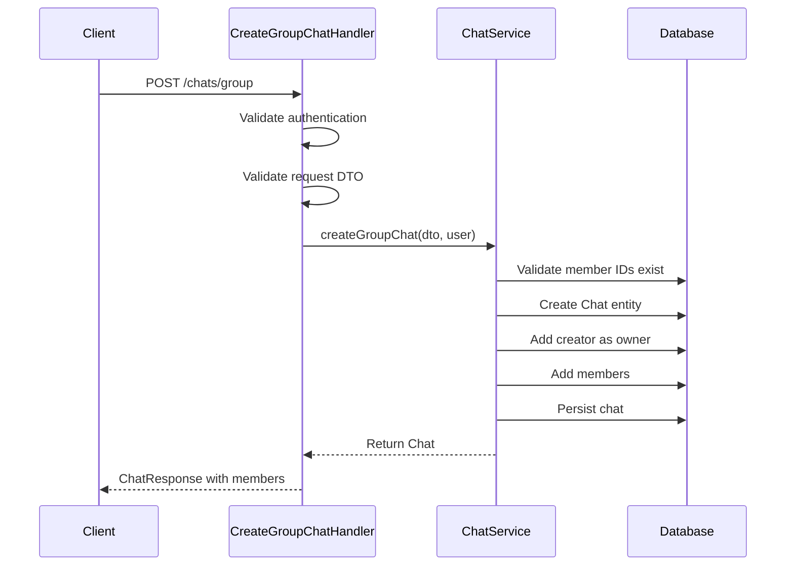
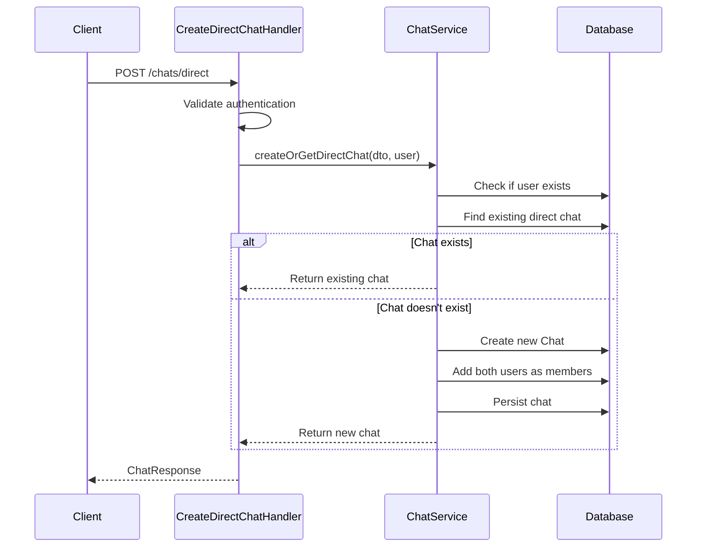
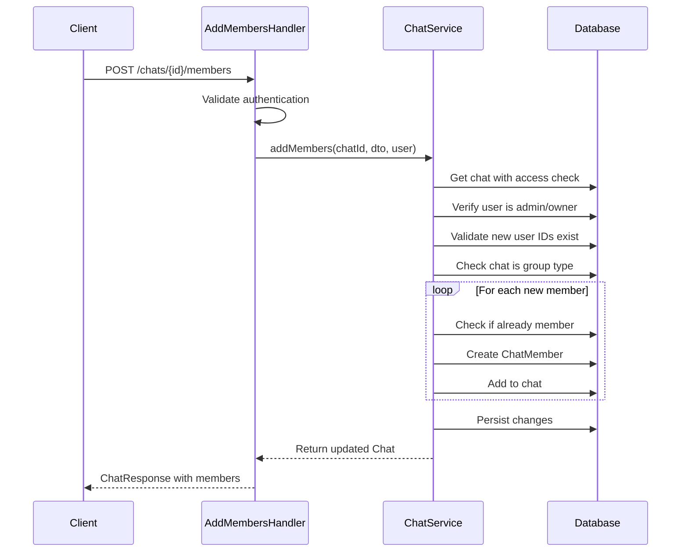
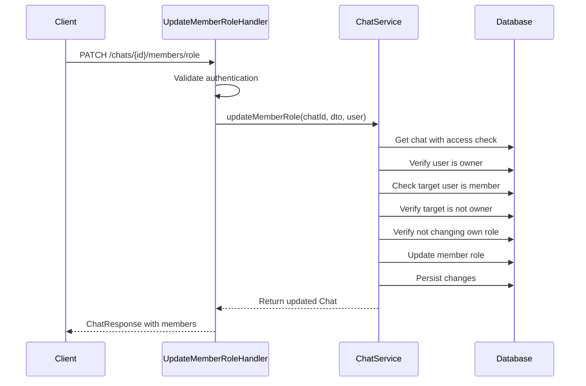
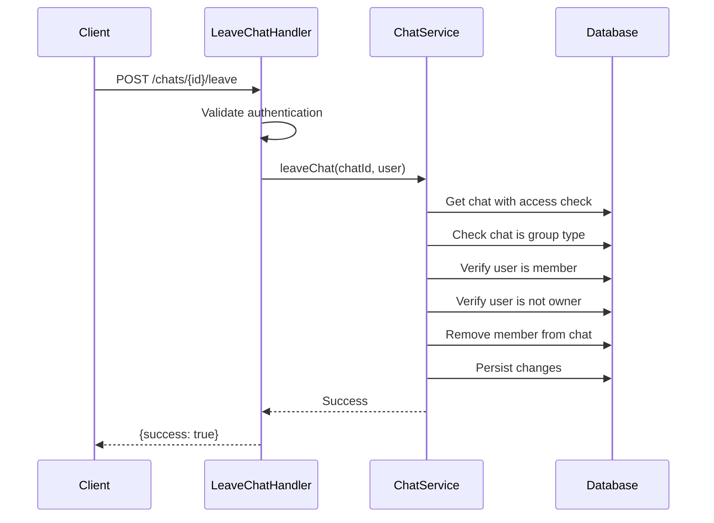
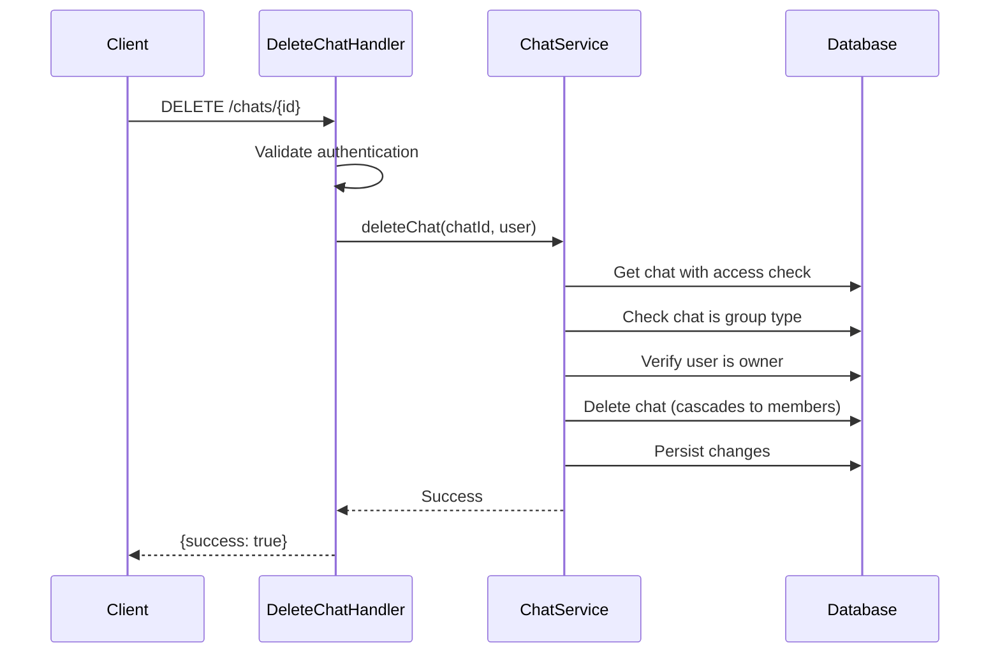

# Chat Module

**Chat and Messaging Module**

## Overview

The Chat module is responsible for managing group chats and direct messages in the BuzzChat application. It provides comprehensive functionality for creating, managing, and moderating conversations with role-based access control.

## Responsibility

- Group chat creation and management
- Direct (1-on-1) messaging
- Chat member management (add/remove)
- Role-based permissions (owner, admin, member)
- Chat settings (name, description, photo)
- Member role management
- Access control and authorization

## Architecture

### Clean Architecture Layers

```
┌─────────────────────────────────────────┐
│         Presentation Layer              │
│  (Handlers - HTTP Controllers)          │
│  - CreateGroupChatHandler               │
│  - CreateDirectChatHandler              │
│  - GetUserChatsHandler                  │
│  - GetChatHandler                       │
│  - UpdateChatHandler                    │
│  - AddMembersHandler                    │
│  - RemoveMemberHandler                  │
│  - LeaveChatHandler                     │
│  - UpdateMemberRoleHandler              │
│  - DeleteChatHandler                    │
└─────────────────────────────────────────┘
              ↓
┌─────────────────────────────────────────┐
│         Application Layer                │
│  (Services - Business Logic)            │
│  - ChatService                          │
│    ├── Chat creation & retrieval        │
│    ├── Member management                │
│    ├── Permission validation            │
│    └── Access control checks            │
└─────────────────────────────────────────┘
              ↓
┌─────────────────────────────────────────┐
│         Domain Layer                     │
│  (Entities, Value Objects, Exceptions)  │
│  - Chat                                 │
│  - ChatMember                           │
│  - Role constants                       │
│  - Exceptions                           │
└─────────────────────────────────────────┘
              ↓
┌─────────────────────────────────────────┐
│         Infrastructure Layer             │
│  (Repositories, Database)               │
│  - ChatRepository                       │
│  - ChatMemberRepository                 │
│  - Doctrine ORM                         │
└─────────────────────────────────────────┘
```

### CQRS Pattern

Handlers follow the CQRS pattern:

**Commands** (Write Operations):
- `CreateGroupChatHandler` - Create group chat
- `CreateDirectChatHandler` - Create/get direct chat
- `UpdateChatHandler` - Update chat settings
- `AddMembersHandler` - Add members to chat
- `RemoveMemberHandler` - Remove member from chat
- `LeaveChatHandler` - Leave chat
- `UpdateMemberRoleHandler` - Update member role
- `DeleteChatHandler` - Delete chat

**Queries** (Read Operations):
- `GetUserChatsHandler` - Get all user's chats
- `GetChatHandler` - Get specific chat details

## Components

### Handlers (Presentation Layer)

One handler per action following Single Responsibility Principle:

- **CreateGroupChatHandler** - Creates new group chat with members
- **CreateDirectChatHandler** - Creates or retrieves direct chat between two users
- **GetUserChatsHandler** - Lists all chats for authenticated user
- **GetChatHandler** - Retrieves specific chat with members
- **UpdateChatHandler** - Updates chat name, description, or photo (admins only)
- **AddMembersHandler** - Adds new members to group chat (admins only)
- **RemoveMemberHandler** - Removes member from chat (admins only)
- **LeaveChatHandler** - Allows member to leave chat
- **UpdateMemberRoleHandler** - Updates member role (owner only)
- **DeleteChatHandler** - Deletes chat (owner only)

### Services (Business Logic)

- **ChatService** - Core chat management logic
  - `createGroupChat()` - Create group chat with validation
  - `createOrGetDirectChat()` - Create or retrieve direct chat
  - `updateChat()` - Update chat settings with permission checks
  - `addMembers()` - Add members with validation
  - `removeMember()` - Remove member with permission checks
  - `leaveChat()` - Handle member leaving
  - `updateMemberRole()` - Update member permissions
  - `deleteChat()` - Delete chat with ownership check
  - `getUserChats()` - Retrieve user's chats
  - `getChat()` - Get specific chat with access check

### Entities (Domain Models)

- **Chat** - Main chat entity
  - `id` - Unique identifier
  - `type` - Chat type (direct/group)
  - `name` - Chat name (nullable for direct chats)
  - `description` - Chat description
  - `photoUrl` - Chat photo URL
  - `createdAt` - Creation timestamp
  - `updatedAt` - Last update timestamp
  - `members` - Collection of ChatMember entities

- **ChatMember** - Chat membership entity
  - `id` - Unique identifier
  - `chat` - Reference to Chat
  - `user` - Reference to User
  - `role` - Member role (owner/admin/member)
  - `joinedAt` - Join timestamp
  - `leftAt` - Leave timestamp (nullable)

### Repositories

- **ChatRepository** - Chat data access
  - `findDirectChatBetweenUsers()` - Find existing direct chat
  - `findUserChats()` - Get all user's chats
  - `findUserGroupChats()` - Get user's group chats
  - `findUserDirectChats()` - Get user's direct chats
  - `existsForUser()` - Check chat access

- **ChatMemberRepository** - Chat member data access
  - `findActiveByChatAndUser()` - Get active membership
  - `findOwnerByChatId()` - Get chat owner

### DTOs (Data Transfer Objects)

**Request DTOs:**
- `CreateGroupChatRequest` - Group chat creation data
- `CreateDirectChatRequest` - Direct chat creation data
- `UpdateChatRequest` - Chat update data
- `AddMembersRequest` - Member addition data
- `UpdateMemberRoleRequest` - Role update data

**Response DTOs:**
- `ChatResponse` - Chat data with optional members
- `ChatMemberResponse` - Member data with user info

### Exceptions

- **ChatException** - Base chat exception
- **ChatNotFoundException** - Chat not found
- **ChatAccessDeniedException** - Insufficient permissions
- **UserNotFoundException** - User not found
- **DirectChatAlreadyExistsException** - Direct chat exists
- **InvalidChatOperationException** - Invalid operation

## Chat Types

### Direct Chat

Personal 1-on-1 conversation between two users.

**Characteristics:**
- Type: `direct`
- Always has exactly 2 members
- Cannot be modified (name, description, photo)
- Cannot be deleted
- Members cannot be added or removed
- Both members have equal permissions
- Automatically created on first message

### Group Chat

Multi-participant conversation with roles and permissions.

**Characteristics:**
- Type: `group`
- Can have 2+ members (up to 100)
- Has creator (owner) with full control
- Can have admins with management permissions
- Has name, description, and photo
- Can be modified by admins
- Can be deleted by owner

## Member Roles

### Owner

Chat creator with full control.

**Permissions:**
- All admin permissions
- Delete chat
- Transfer ownership (future feature)
- Cannot be removed
- Cannot leave (must delete or transfer ownership)

### Admin

Trusted member with management permissions.

**Permissions:**
- Update chat settings (name, description, photo)
- Add new members
- Remove members (except owner)
- Can leave chat
- Cannot change roles

### Member

Regular participant.

**Permissions:**
- Read and send messages
- Leave chat
- View chat info
- No management permissions

## Chat Flows

### Create Group Chat Flow



### Create Direct Chat Flow



### Add Members Flow



### Update Member Role Flow



### Leave Chat Flow



### Delete Chat Flow



## Security Features

### Access Control

- **Membership Validation**: All operations verify user is chat member
- **Role-based Permissions**: Different actions require specific roles
- **Owner Protection**: Owner cannot be removed or have role changed
- **Direct Chat Protection**: Direct chats cannot be modified or deleted

### Permission Matrix

| Action | Owner | Admin | Member |
|--------|-------|-------|--------|
| Read messages | ✓ | ✓ | ✓ |
| Send messages | ✓ | ✓ | ✓ |
| View members | ✓ | ✓ | ✓ |
| Add members | ✓ | ✓ | ✗ |
| Remove members | ✓ | ✓ | ✗ |
| Update settings | ✓ | ✓ | ✗ |
| Change roles | ✓ | ✗ | ✗ |
| Delete chat | ✓ | ✗ | ✗ |
| Leave chat | ✗* | ✓ | ✓ |

*Owner must delete chat or transfer ownership first

### Validation Rules

#### CreateGroupChatRequest
- `name`: Required, 1-255 characters
- `description`: Optional, max 500 characters
- `memberIds`: Required array, 1-100 member IDs

#### CreateDirectChatRequest
- `userId`: Required, must exist, cannot be self

#### UpdateChatRequest
- `name`: Optional, 1-255 characters
- `description`: Optional, max 500 characters
- `photoUrl`: Optional, valid URL

#### AddMembersRequest
- `userIds`: Required array, valid user IDs

#### UpdateMemberRoleRequest
- `userId`: Required, must be member
- `role`: Required, admin or member (not owner)

## Error Handling

### Custom Exceptions

- **ChatNotFoundException** (404) - Chat not found
- **ChatAccessDeniedException** (403) - Insufficient permissions
- **UserNotFoundException** (404) - User not found
- **DirectChatAlreadyExistsException** (409) - Direct chat exists
- **InvalidChatOperationException** (400) - Invalid operation
  - Cannot modify direct chat
  - Cannot remove self (use leave)
  - Cannot remove owner
  - Cannot change own role
  - Cannot change owner role
  - User not member
  - User already member

### HTTP Status Codes

- `200 OK` - Success
- `201 Created` - Chat created
- `400 Bad Request` - Validation error, invalid operation
- `401 Unauthorized` - Not authenticated
- `403 Forbidden` - Insufficient permissions
- `404 Not Found` - Chat or user not found
- `409 Conflict` - Resource conflict
- `500 Internal Server Error` - Server error

## Database Schema

### Chat Table

```sql
CREATE TABLE chats (
    id SERIAL PRIMARY KEY,
    type VARCHAR(20) NOT NULL CHECK (type IN ('direct', 'group')),
    name VARCHAR(255),
    description VARCHAR(500),
    photo_url VARCHAR(255),
    created_at TIMESTAMP NOT NULL,
    updated_at TIMESTAMP
);

CREATE INDEX idx_type ON chats(type);
CREATE INDEX idx_created_at ON chats(created_at);
```

### ChatMember Table

```sql
CREATE TABLE chat_members (
    id SERIAL PRIMARY KEY,
    chat_id INTEGER NOT NULL REFERENCES chats(id) ON DELETE CASCADE,
    user_id INTEGER NOT NULL REFERENCES users(id) ON DELETE CASCADE,
    role VARCHAR(20) NOT NULL CHECK (role IN ('owner', 'admin', 'member')),
    joined_at TIMESTAMP NOT NULL,
    left_at TIMESTAMP,
    UNIQUE (chat_id, user_id)
);

CREATE INDEX idx_role ON chat_members(role);
CREATE INDEX idx_joined_at ON chat_members(joined_at);
CREATE UNIQUE INDEX uniq_chat_user ON chat_members(chat_id, user_id);
```

## Design Patterns Used

### Repository Pattern

Data access abstracted through repositories:
- Testable without database
- Complex queries encapsulated
- Separation of concerns

```php
// Custom query methods
$chat = $this->chatRepository->findDirectChatBetweenUsers($userId1, $userId2);
$chats = $this->chatRepository->findUserChats($userId);
```

### DTO Pattern

Request/response data transfer:
- Validation separation
- API contract clarity
- Type safety

```php
// Request validation
$dto = new CreateGroupChatRequest();
$errors = $this->validator->validate($dto);

// Response serialization
$response = ChatResponse::fromEntity($chat, includeMembers: true);
```

### Handler Pattern (Command Pattern)

One handler per action:
- Single Responsibility
- Easy to test
- Clear intent

```php
// Each handler does one thing
CreateGroupChatHandler::__invoke()
UpdateChatHandler::__invoke()
DeleteChatHandler::__invoke()
```

### Factory Pattern

Response creation from entities:
- Consistent serialization
- Controlled data exposure
- Reusable transformations

```php
ChatResponse::fromEntity($chat, includeMembers: true);
ChatMemberResponse::fromEntity($member);
```

### Strategy Pattern

Permission validation:
- Role-based access checks
- Extensible permission system

```php
// Permission checks
$member->canManageChat() // owner or admin
$member->isOwner()       // owner only
```

## Business Rules

### Direct Chat Rules

1. Cannot create direct chat with yourself
2. Only one direct chat per user pair
3. Cannot modify direct chat properties
4. Cannot delete direct chat
5. Cannot add/remove members
6. Both users have equal permissions

### Group Chat Rules

1. Creator becomes owner
2. Only one owner per chat
3. Owner cannot leave (must delete or transfer)
4. Owner cannot be removed
5. Members added with 'member' role by default
6. Only admins/owners can manage chat
7. Only owner can change roles
8. Only owner can delete chat

### Member Management Rules

1. Cannot remove yourself (use leave)
2. Cannot change your own role
3. Cannot remove or change owner
4. Maximum 100 members per chat
5. Cannot add already existing members
6. All member IDs must exist

## Testing

### Unit Tests

```bash
./vendor/bin/phpunit --testsuite=Chat
```

### Test Coverage

- Handler tests (request/response)
- Service tests (business logic)
- Repository tests (data access)
- Entity tests (domain logic)
- Integration tests (full flow)

### Example Test

```php
public function testCreateGroupChatSuccess(): void
{
    $dto = new CreateGroupChatRequest();
    $dto->name = 'Engineering Team';
    $dto->description = 'Team discussions';
    $dto->memberIds = [2, 3, 4];

    $chat = $this->chatService->createGroupChat($dto, $this->user);

    $this->assertEquals('group', $chat->getType());
    $this->assertEquals('Engineering Team', $chat->getName());
    $this->assertEquals(4, $chat->getMembersCount()); // creator + 3 members
}

public function testOnlyOwnerCanDeleteChat(): void
{
    $chat = $this->createGroupChat();
    $member = $this->createMember($chat, role: 'admin');

    $this->expectException(ChatAccessDeniedException::class);
    $this->chatService->deleteChat($chat->getId(), $member->getUser());
}
```

## Performance Considerations

### Database Optimization

- Indexes on frequently queried fields (type, created_at, role)
- Unique constraint on chat_id + user_id
- Cascade deletes for cleanup
- Query optimization in repositories

### Caching Strategies (Future)

```php
// Cache user's chat list
$cacheKey = "user_chats_{$userId}";
$chats = $cache->get($cacheKey, function() use ($userId) {
    return $this->chatRepository->findUserChats($userId);
});

// Invalidate on changes
$cache->delete("user_chats_{$userId}");
```

### Eager Loading

```php
// Avoid N+1 queries
$chat = $this->chatRepository->findOneBy(['id' => $chatId]);
// Load members in single query
$members = $chat->getMembers(); // Already loaded by Doctrine
```

## Future Enhancements

1. **Message Integration**
   - Link to Message module
   - Last message preview
   - Unread count

2. **Chat Archiving**
   - Archive chats instead of delete
   - Restore archived chats
   - Retention policies

3. **Advanced Permissions**
   - Custom roles
   - Fine-grained permissions
   - Role templates

4. **Chat Templates**
   - Predefined chat structures
   - Default settings
   - Quick setup

5. **Ownership Transfer**
   - Transfer ownership to another member
   - Ownership history
   - Automatic transfer on owner leave

6. **Member Limits**
   - Configurable member limits
   - Premium chat features
   - Member capacity management

7. **Invite Links**
   - Generate shareable invite links
   - Invite expiration
   - Link revocation

8. **Chat Categories/Folders**
   - Organize chats into folders
   - Tags and labels
   - Smart filters

9. **Read Receipts**
   - Track who read messages
   - Last read timestamp
   - Read indicators

10. **Typing Indicators**
    - Real-time typing status
    - Multiple users typing
    - WebSocket integration

## API Reference

See [API Documentation](./API.md) for detailed endpoint documentation.

## Dependencies

- `symfony/security-bundle` - Security and authentication
- `symfony/validator` - DTO validation
- `symfony/serializer` - Request/response serialization
- `doctrine/orm` - Database ORM
- `doctrine/doctrine-bundle` - Doctrine integration

## Integration Points

### Auth Module
- User authentication via JWT
- User entity references
- Permission checks

### Message Module (Future)
- Message storage per chat
- Message delivery
- Message history

### WebSocket Gateway (GoGate)
- Real-time updates
- Member presence
- Typing indicators
- New message notifications

## Maintainers

BuzzChat Development Team

## License

Proprietary
