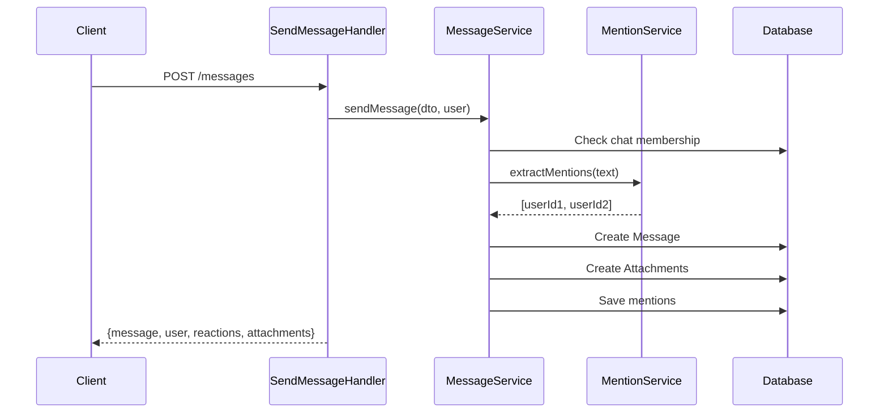
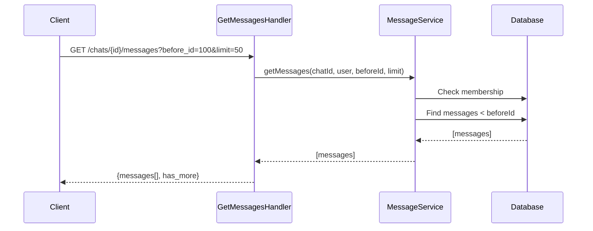
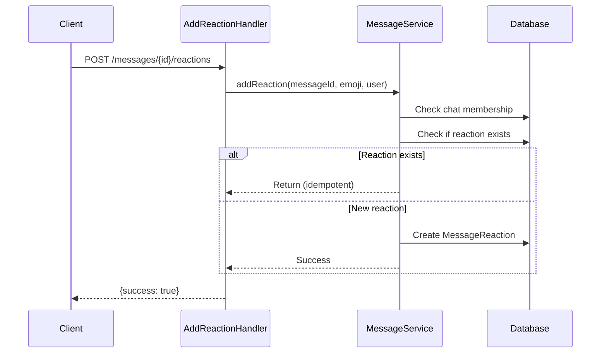
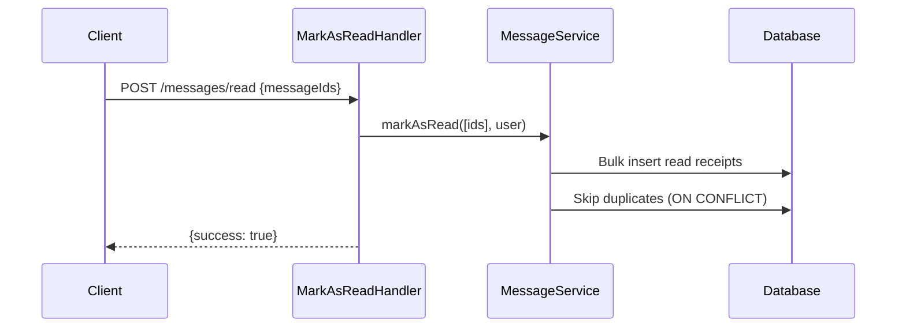

# Message Module

**Messaging and Communication Module**

## Overview

The Message module is responsible for managing real-time communication between users in chats. It handles message sending, editing, deletion, reactions, read receipts, file attachments, and mentions with support for pagination and search.

## Responsibility

- Send text messages with optional attachments and replies
- Edit and delete messages (soft delete)
- Emoji reactions to messages
- Read receipts and unread message tracking
- @mentions extraction and notification
- Message history with cursor-based pagination
- Full-text message search
- File attachments with thumbnails
- Message type management (text, file, image, system)

## Architecture

### Clean Architecture Layers

```
┌─────────────────────────────────────────┐
│         Presentation Layer              │
│  (Handlers - HTTP Controllers)          │
│  - SendMessageHandler                   │
│  - GetMessagesHandler                   │
│  - UpdateMessageHandler                 │
│  - DeleteMessageHandler                 │
│  - AddReactionHandler                   │
│  - MarkAsReadHandler                    │
└─────────────────────────────────────────┘
              ↓
┌─────────────────────────────────────────┐
│         Application Layer                │
│  (Services - Business Logic)            │
│  - MessageService                       │
│  - MentionService                       │
└─────────────────────────────────────────┘
              ↓
┌─────────────────────────────────────────┐
│         Domain Layer                     │
│  (Entities, Value Objects, Exceptions)  │
│  - Message                              │
│  - MessageAttachment                    │
│  - MessageReaction                      │
│  - MessageReadReceipt                   │
│  - Exceptions                           │
└─────────────────────────────────────────┘
              ↓
┌─────────────────────────────────────────┐
│         Infrastructure Layer             │
│  (Repositories, External Services)      │
│  - MessageRepository                    │
│  - MessageAttachmentRepository          │
│  - MessageReactionRepository            │
│  - MessageReadReceiptRepository         │
│  - ChatRepository (dependency)          │
│  - ChatMemberRepository (dependency)    │
└─────────────────────────────────────────┘
```

### CQRS Pattern

Handlers follow the CQRS pattern:

**Commands** (Write Operations):
- `SendMessageHandler` - Send new message
- `UpdateMessageHandler` - Edit message text
- `DeleteMessageHandler` - Soft delete message
- `AddReactionHandler` - Add emoji reaction
- `MarkAsReadHandler` - Mark messages as read

**Queries** (Read Operations):
- `GetMessagesHandler` - Get message history with pagination

## Components

### Handlers (Presentation Layer)

One handler per action following Single Responsibility Principle:

- **SendMessageHandler** - Send message to chat with attachments, mentions, replies
- **GetMessagesHandler** - Get paginated message history for chat
- **UpdateMessageHandler** - Edit message text (owner only)
- **DeleteMessageHandler** - Soft delete message (owner only)
- **AddReactionHandler** - Add emoji reaction to message
- **MarkAsReadHandler** - Mark multiple messages as read

### Services (Business Logic)

- **MessageService** - Core messaging logic
  - `sendMessage()` - Send message with validation
  - `updateMessage()` - Edit message
  - `deleteMessage()` - Soft delete
  - `addReaction()` - Add emoji reaction
  - `removeReaction()` - Remove emoji reaction
  - `markAsRead()` - Mark messages as read
  - `getMessages()` - Paginated message retrieval
  - `getUnreadCount()` - Count unread messages
  - `searchMessages()` - Full-text search
  - `getMentions()` - Get messages mentioning user
  - `getMessage()` - Get single message by ID

- **MentionService** - User mention handling
  - `extractMentions()` - Extract @mentions from text
  - `formatMentions()` - Format mentions as HTML

### Entities (Domain Models)

- **Message** - Main message entity
  - Types: text, file, image, system
  - Soft delete support (deletedAt)
  - Edit tracking (editedAt)
  - Reply threading (replyTo)
  - JSON mentions storage

- **MessageAttachment** - File attachments
  - File URL, name, size, type
  - Optional thumbnail URL
  - Image detection helper

- **MessageReaction** - Emoji reactions
  - Unique constraint: message + user + emoji
  - Grouped by emoji in responses

- **MessageReadReceipt** - Read tracking
  - Unique constraint: message + user
  - Timestamp when read

### Repositories

- **MessageRepository** - Message data access
  - `findByChatId()` - Cursor-based pagination
  - `search()` - Full-text search
  - `countUnread()` - Unread count per chat
  - `findMentions()` - Messages with user mentions
  - `getLastMessageInChat()` - Latest message

- **MessageAttachmentRepository** - Attachment data access
- **MessageReactionRepository** - Reaction data access
  - `findByMessageUserEmoji()` - Find specific reaction

- **MessageReadReceiptRepository** - Read receipt data access
  - `markAsRead()` - Bulk mark as read

### DTOs (Data Transfer Objects)

**Request DTOs:**
- `SendMessageRequest` - Message data with attachments
- `UpdateMessageRequest` - Updated text
- `AddReactionRequest` - Emoji reaction
- `MarkAsReadRequest` - Message IDs to mark read

**Response DTOs:**
- `MessageResponse` - Complete message with reactions, attachments, etc.

### Exceptions

- **MessageException** - Base message exception
- **MessageNotFoundException** - Message not found (404)
- **MessageAccessDeniedException** - Access denied (403)

## Message Flow

### Send Message Flow



### Get Messages Flow (Pagination)



### Add Reaction Flow



### Mark as Read Flow



## Database Schema

### Messages Table

| Column | Type | Description |
|--------|------|-------------|
| id | INT | Primary key |
| chat_id | INT | Foreign key to chats |
| user_id | INT | Foreign key to users (sender) |
| type | VARCHAR(20) | text, file, image, system |
| text | TEXT | Message text content |
| reply_to_id | INT | Foreign key to messages (nullable) |
| mentions | JSON | Array of user IDs |
| created_at | DATETIME | Creation timestamp |
| updated_at | DATETIME | Last update timestamp |
| edited_at | DATETIME | Edit timestamp (nullable) |
| deleted_at | DATETIME | Soft delete timestamp (nullable) |

**Indexes:**
- `IDX_CHAT_CREATED (chat_id, created_at)` - Message retrieval
- `IDX_USER (user_id)` - User's messages
- `IDX_TYPE (type)` - Filter by type
- `IDX_DELETED (deleted_at)` - Exclude deleted

### Message Attachments Table

| Column | Type | Description |
|--------|------|-------------|
| id | INT | Primary key |
| message_id | INT | Foreign key to messages |
| file_url | VARCHAR(500) | File URL |
| file_name | VARCHAR(255) | Original filename |
| file_size | BIGINT | Size in bytes |
| file_type | VARCHAR(100) | MIME type |
| thumbnail_url | VARCHAR(500) | Thumbnail URL (nullable) |
| created_at | DATETIME | Upload timestamp |

**Indexes:**
- `IDX_MESSAGE (message_id)` - Attachment lookup

### Message Reactions Table

| Column | Type | Description |
|--------|------|-------------|
| id | INT | Primary key |
| message_id | INT | Foreign key to messages |
| user_id | INT | Foreign key to users |
| emoji | VARCHAR(20) | Emoji character/code |
| created_at | DATETIME | Reaction timestamp |

**Indexes:**
- `UNIQ_MESSAGE_USER_EMOJI (message_id, user_id, emoji)` - Prevent duplicates
- `IDX_MESSAGE (message_id)` - Reaction lookup
- `IDX_USER (user_id)` - User's reactions

### Message Read Receipts Table

| Column | Type | Description |
|--------|------|-------------|
| id | INT | Primary key |
| message_id | INT | Foreign key to messages |
| user_id | INT | Foreign key to users |
| read_at | DATETIME | When message was read |

**Indexes:**
- `UNIQ_MESSAGE_USER (message_id, user_id)` - One receipt per user
- `IDX_MESSAGE (message_id)` - Read count lookup
- `IDX_USER (user_id)` - User's read messages
- `IDX_READ_AT (read_at)` - Sort by read time

## Features

### 1. Message Types

- **text** - Regular text message
- **file** - File attachment (documents, archives, etc.)
- **image** - Image with thumbnail
- **system** - System notification (user joined, etc.)

### 2. Mentions

Format: `@username` in message text

- Automatic extraction during send/edit
- Stored as JSON array of user IDs
- Can query messages mentioning specific user
- Frontend can highlight/link mentions

Example:
```json
{
  "text": "Hey @john, check this out!",
  "mentions": [42]
}
```

### 3. Reactions

- One user can react with same emoji once
- Reactions grouped by emoji in response
- Shows count and user list per emoji
- Idempotent: adding existing reaction does nothing

Response format:
```json
{
  "reactions": [
    {
      "emoji": "👍",
      "count": 3,
      "users": [
        {"id": 1, "name": "John Doe"},
        {"id": 2, "name": "Jane Smith"}
      ]
    }
  ]
}
```

### 4. Read Receipts

- Tracks when each user read each message
- Bulk mark as read for performance
- Count unread messages per chat
- Show read count in message response

### 5. Pagination

Cursor-based pagination using `before_id`:

```
GET /chats/1/messages?limit=50
GET /chats/1/messages?before_id=100&limit=50
```

- More efficient than offset pagination
- Works with real-time updates
- Returns `has_more` flag

### 6. Soft Delete

- Messages not physically deleted
- `deleted_at` timestamp set
- Excluded from queries by default
- Can restore if needed

### 7. Edit Tracking

- `edited_at` timestamp
- `updated_at` for any change
- Original creation time preserved
- Frontend shows "edited" badge

### 8. Reply Threading

- Reference parent message via `reply_to_id`
- Response includes reply context:
  ```json
  {
    "reply_to": {
      "id": 42,
      "user": {"id": 1, "name": "John"},
      "text": "Original message",
      "type": "text"
    }
  }
  ```

### 9. File Attachments

- Multiple attachments per message
- Metadata: filename, size, MIME type
- Optional thumbnail for images/videos
- Helper methods: `isImage()`, `getFileSizeFormatted()`

### 10. Full-Text Search

- Search across all user's chats
- Optional: search within specific chat
- Searches only message text
- Orders by relevance (newest first)

## Validation Rules

### SendMessageRequest

- `chatId`: Required, positive integer
- `text`: Optional, max 10,000 characters
- `replyToId`: Optional, positive integer
- `attachmentIds`: Optional array
- At least one of: text or attachmentIds

### UpdateMessageRequest

- `text`: Required, max 10,000 characters

### AddReactionRequest

- `emoji`: Required, 1-20 characters

### MarkAsReadRequest

- `messageIds`: Required array of positive integers

## Error Handling

### Custom Exceptions

- **MessageException** - Base exception with status code
- **MessageNotFoundException** - Message not found (404)
- **MessageAccessDeniedException** - Not authorized (403)
  - `notChatMember()` - User not in chat
  - `cannotEditMessage()` - Not message owner
  - `cannotDeleteMessage()` - Not message owner

### HTTP Status Codes

- `200 OK` - Success
- `201 Created` - Message sent
- `400 Bad Request` - Validation error
- `401 Unauthorized` - Not authenticated
- `403 Forbidden` - Not chat member or not owner
- `404 Not Found` - Message or chat not found
- `422 Unprocessable Entity` - Business logic error

## Performance Considerations

### Database Indexes

All critical queries indexed:
- Message lookup by chat + creation time
- User's messages
- Unread message counting
- Mention queries (JSON_CONTAINS)
- Reaction grouping

### Query Optimization

- **Eager Loading**: Messages loaded with user, reply, attachments
- **Batch Operations**: Mark multiple messages as read in one query
- **Pagination**: Cursor-based prevents offset performance issues
- **Soft Delete**: Index on `deleted_at` for fast filtering

### Caching Strategies (Future)

- Cache last 50 messages per chat
- Cache unread counts
- Cache user mentions
- Invalidate on new message

## Security Features

### Access Control

- All operations require authentication
- Chat membership verified for all operations
- Only message owner can edit/delete
- Read receipts only for chat members

### Input Validation

- Message length limits (10,000 chars)
- Emoji validation (max 20 chars)
- URL validation for attachments
- XSS prevention via serialization

### Privacy

- Soft delete preserves audit trail
- Read receipts optional (can be disabled)
- Mentions only work for valid users

## Integration Points

### Chat Module

- Validates chat membership before all operations
- Uses ChatRepository and ChatMemberRepository
- Last message displayed in chat list

### User Module

- Mentions link to User entities
- User info included in message responses
- Online status affects read receipts

### File Upload Service (Future)

- Attachment upload separate from message send
- Generate thumbnails for images
- Virus scanning
- CDN integration

### WebSocket Gateway (Future)

- Real-time message delivery
- Typing indicators
- Read receipt broadcasts
- Reaction updates

## Testing

### Unit Tests

```bash
./vendor/bin/phpunit tests/Message/
```

### Test Coverage

- Service layer tests (business logic)
- Repository tests (data access)
- Handler tests (API contracts)
- Integration tests (full flows)

### Example Tests

```php
public function testSendMessageSuccess(): void
{
    $dto = new SendMessageRequest();
    $dto->chatId = 1;
    $dto->text = 'Hello world!';

    $message = $this->messageService->sendMessage($dto, $this->user);

    $this->assertEquals('Hello world!', $message->getText());
    $this->assertEquals(Message::TYPE_TEXT, $message->getType());
}

public function testCannotEditOtherUsersMessage(): void
{
    $this->expectException(MessageAccessDeniedException::class);

    $dto = new UpdateMessageRequest();
    $dto->text = 'Hacked!';

    $this->messageService->updateMessage(999, $dto, $this->otherUser);
}
```

## Design Patterns Used

### Repository Pattern

Data access abstracted through repositories:
- Testable without database
- Complex queries encapsulated
- Can switch ORM easily

### DTO Pattern

Request/response data transfer:
- Clear API contracts
- Validation separation
- Type safety

### Handler Pattern (Command Pattern)

One handler per action:
- Single Responsibility
- Easy to test
- Clear intent

### Strategy Pattern (Future)

Mention matching can use different strategies:
- Username matching
- Email matching
- Phone matching
- Display name matching

### Observer Pattern (Future)

Event dispatching for:
- New message notifications
- Mention notifications
- WebSocket broadcasts

## Future Enhancements

1. **Rich Media**
   - Embed link previews
   - GIF support
   - Voice messages
   - Video messages

2. **Advanced Search**
   - Search by date range
   - Search by sender
   - Search by file type
   - Search attachments

3. **Message Features**
   - Pin important messages
   - Forward messages
   - Star/favorite messages
   - Message templates

4. **Bulk Operations**
   - Delete multiple messages
   - Forward multiple messages
   - Export chat history

5. **Analytics**
   - Message count statistics
   - Most active users
   - Response time metrics
   - Engagement tracking

6. **Moderation**
   - Report inappropriate messages
   - Admin delete any message
   - Auto-moderation (bad words filter)
   - Message flagging

7. **Advanced Reactions**
   - Custom emoji reactions
   - Reaction suggestions
   - Reaction analytics

8. **Threading**
   - Full conversation threads
   - Thread summaries
   - Thread notifications

9. **Encryption (E2E)**
   - End-to-end encryption
   - Key management
   - Verified chats

10. **AI Integration**
    - Smart replies
    - Message summarization
    - Translation
    - Sentiment analysis

## API Reference

See [API Documentation](./API.md) for detailed endpoint documentation.

## Dependencies

- `symfony/framework-bundle` - Core framework
- `symfony/security-bundle` - Authentication
- `symfony/validator` - DTO validation
- `symfony/serializer` - Request/response serialization
- `doctrine/orm` - Database ORM
- `doctrine/dbal` - Database abstraction

## Related Modules

- **Auth Module** - User authentication and management
- **Chat Module** - Chat room management
- **User Module** - User profiles and settings

## Maintainers

BuzzChat Development Team

## License

Proprietary
